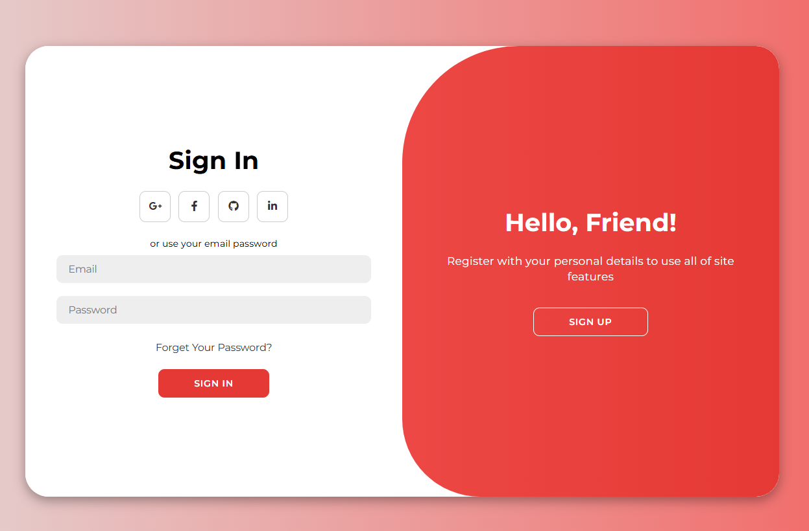

# Modern Login Page

In this, I'm demonstrating how to build a **responsive modern Login Page** using **HTML**, **CSS**, and a touch of **JavaScript**. The design includes smooth **Login and Sign-up transitions**, built with **CSS Flexbox**, **CSS transitions**, and **CSS keyframes** to bring a dynamic user experience.

# 📸 Screenshot

Below is a preview of the login page:

---

# 👩‍💻 By Nikita Yadav

We build creative frontend projects regularly!  
Check out my GitHub for more cool stuff:  
👉 [GitHub - NikitaYadav19](https://github.com/nikitayadav19/login)

If you liked this project, feel free to star ⭐ the repo and follow for more.
